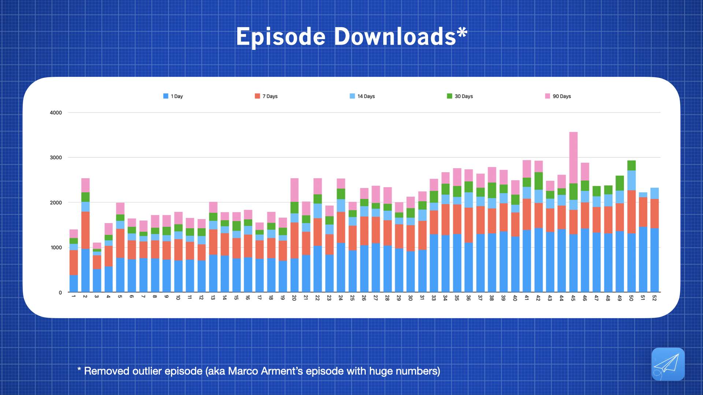
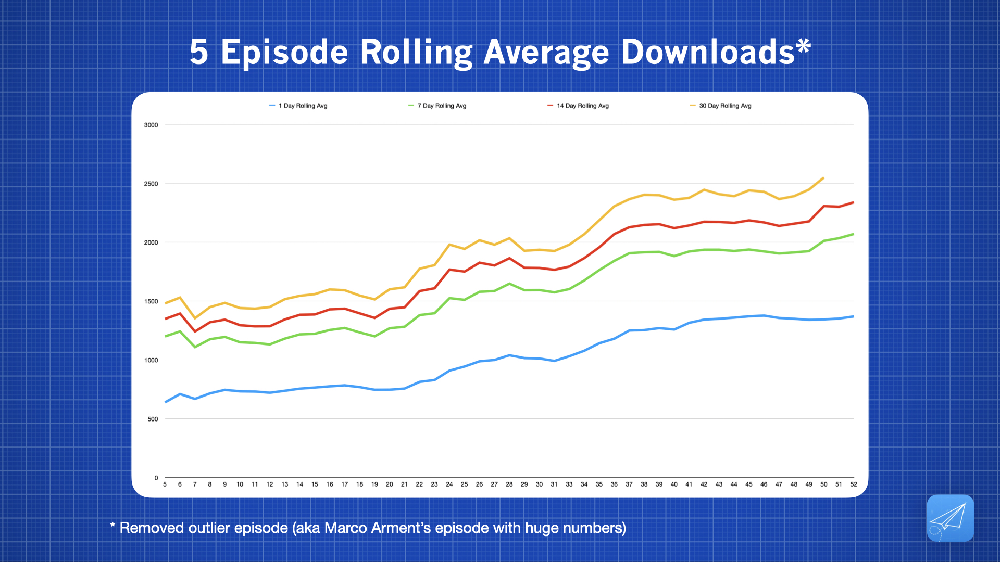
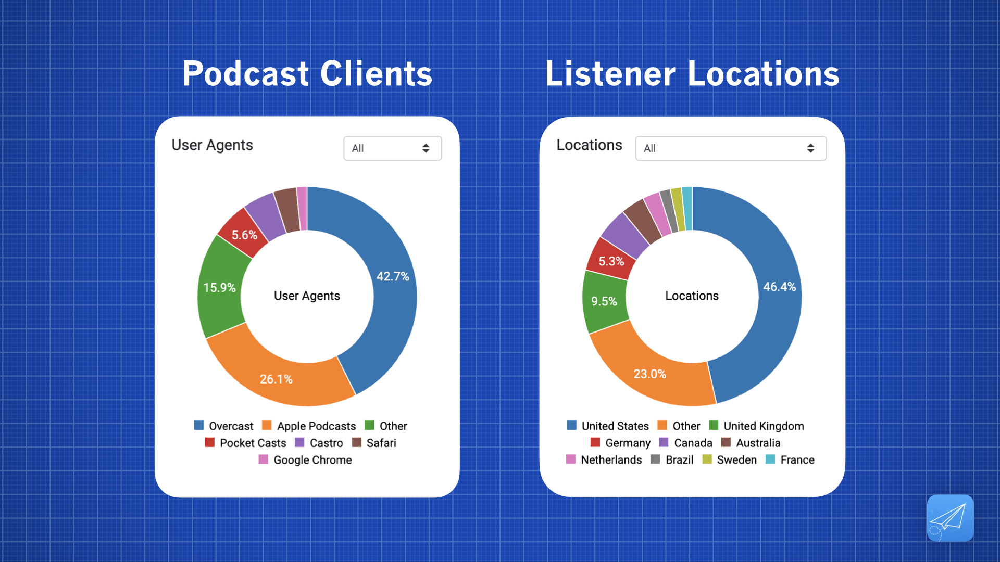

# Metrics

I'll update this page from time to time with graphs generated from the download metrics I get through my podcast host (currently [Fireside](https://fireside.fm/)).

If you're a potential sponsor and would like more granular data please don't hesitate to [email me](mailto:launchedfm@gmail.com)!

#### ** Last updated December 2022 **

